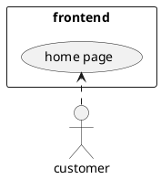

# Introduction
   Welcome to the documentation for the Frontend Service. This document provides an overview of the frontend service and guides you through the installation process. The frontend service is responsible for delivering a user-friendly interface and facilitating interactions with the backend service.

The frontend service utilizes modern web technologies to create a seamless user experience. It is designed to be highly customizable and extensible, allowing you to tailor it to your specific application requirements.

# Installation
   To install the frontend service, follow the steps below:

Prerequisites
Before installing the frontend service, ensure that the following prerequisites are met:

Web browser: [Specify the supported web browsers]
Node.js: [Specify the required Node.js version]
Package manager (e.g., npm or yarn): [Specify the preferred package manager]
Steps
Clone the repository from [repository URL].

bash
Copy code
git clone [repository URL]
Navigate to the project directory.

bash
Copy code
cd [project directory]
Install the dependencies.

Copy code
npm install
or

Copy code
yarn install
Configure the backend service endpoint.

Open the .env file in the project root directory.
Set the value of REACT_APP_BACKEND_URL to the URL of your backend service.
Start the development server.

sql
Copy code
npm start
or

sql
Copy code
yarn start
This command will compile the code and launch a development server. You can access the application in your web browser by visiting http://localhost:3000.

Configuration
The frontend service can be further configured to meet your specific needs. Configuration options can be found in the .env file, allowing you to modify variables such as API endpoints, environment settings, or feature flags. Refer to the comments in the file for detailed instructions on each configuration option.

Conclusion
Congratulations! You have successfully installed the Frontend Service. The installation process outlined in this documentation should have you up and running in no time. In the next sections, you will find more information on how to customize and utilize the frontend service effectively.

Continue reading the documentation to explore additional features and functionalities of the Frontend Service.

